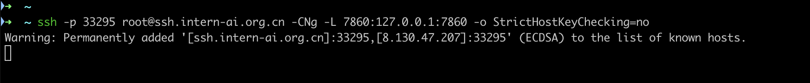
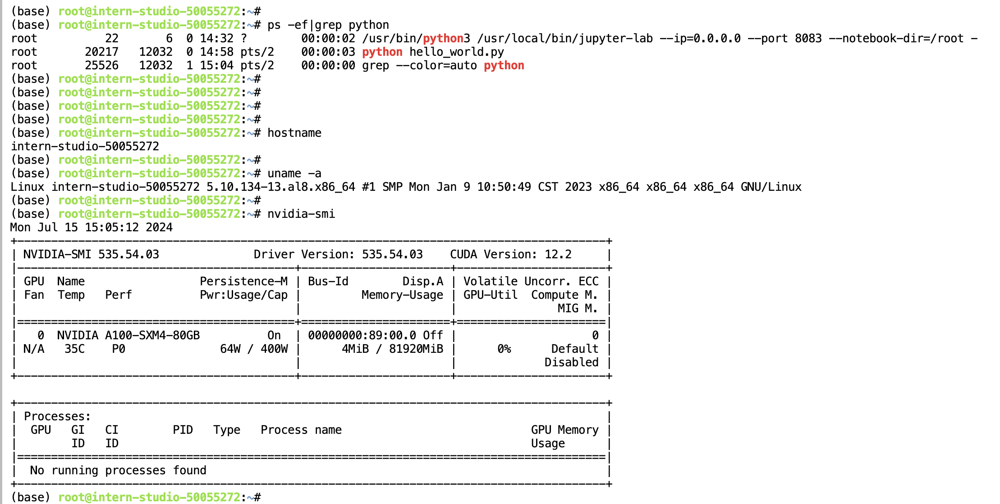
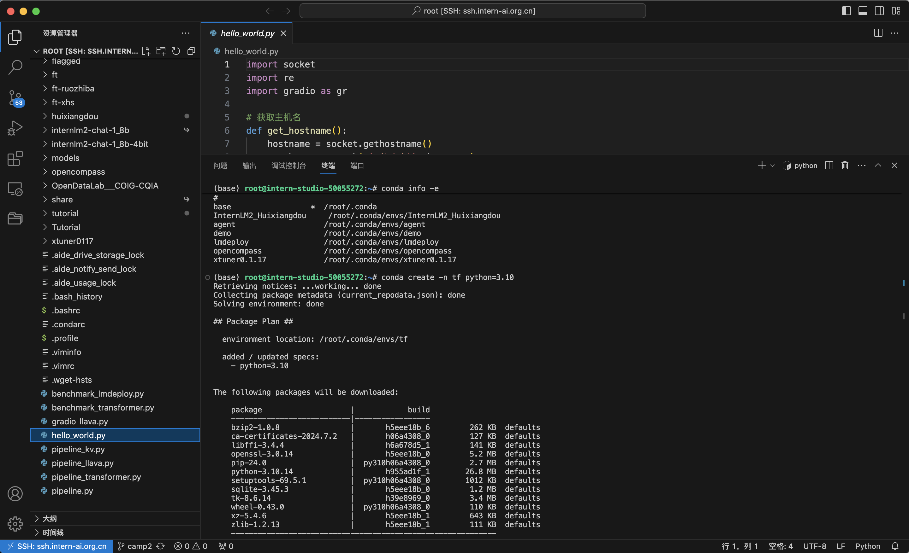
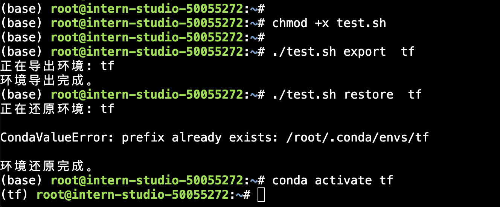

###  一.完成SSH连接与端口映射并运行hello_world.py

#### 1.执行hello_world.py

```
(base) root@intern-studio-50055272:~# python hello_world.py 
Running on local URL:  http://127.0.0.1:7860

To create a public link, set `share=True` in `launch()`.
```

#### 2.进行ssh端口映射



#### 3.访问web页面


###  二.将Linux基础命令在开发机上完成一遍




### 三.使用 VSCODE 远程连接开发机并创建一个conda环境

在本机上，使用vscode连接远程开发机：
```
ssh -p 33295 root@ssh.intern-ai.org.cn -o StrictHostKeyChecking=no -o UserKnownHostsFile=/dev/null
```

并创建一个conda环境：




### 四.创建并运行`test.sh`文件




