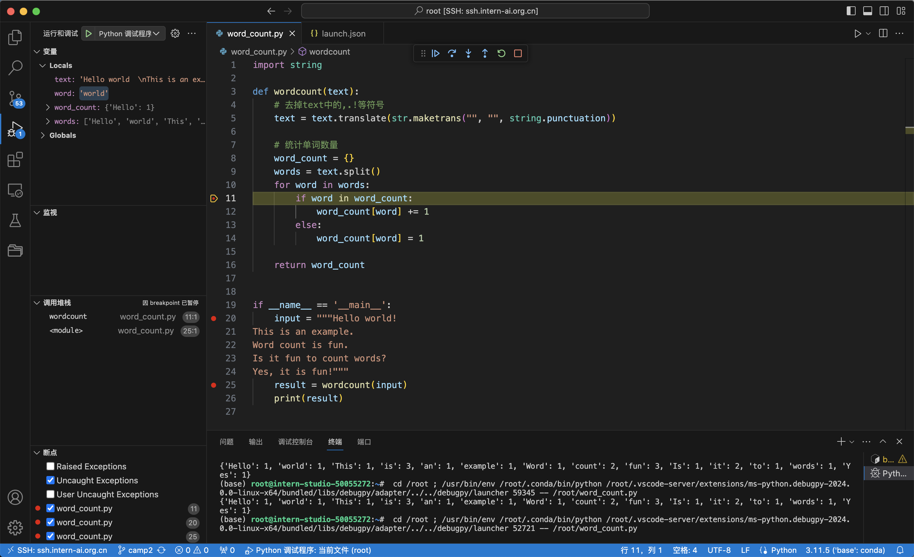

###  一.Python实现wordcount

实现代码如下：

```
import string

def wordcount(text):
    # 去掉text中的,.!等符号
    text = text.translate(str.maketrans("", "", string.punctuation))

    # 统计单词数量
    word_count = {}
    words = text.split()
    for word in words:
        if word in word_count:
            word_count[word] += 1
        else:
            word_count[word] = 1

    return word_count
```

测试程序与输出：

```
if __name__ == '__main__':
    input = """Hello world!  
This is an example.  
Word count is fun.  
Is it fun to count words?  
Yes, it is fun!"""
    result = wordcount(input)
    print(result)
```

```
# python word_count.py
{'Hello': 1, 'world': 1, 'This': 1, 'is': 3, 'an': 1, 'example': 1, 'Word': 1, 'count': 2, 'fun': 3, 'Is': 1, 'it': 2, 'to': 1, 'words': 1, 'Yes': 1}
```


### 二.Vscode连接InternStudio debug笔记 


首先，在本机的vsccode上，为远程机安装Python Debuggger插件。

然后，生成vscode的调试配置文件 launch.json

```
{
    // 使用 IntelliSense 了解相关属性。 
    // 悬停以查看现有属性的描述。
    // 欲了解更多信息，请访问: https://go.microsoft.com/fwlink/?linkid=830387
    "version": "0.2.0",
    "configurations": [
        {
            "name": "Python 调试程序: 当前文件",
            "type": "debugpy",
            "request": "launch",
            "program": "${file}",
            "console": "integratedTerminal"
        }
    ]
}
```

最后，执行调试:




