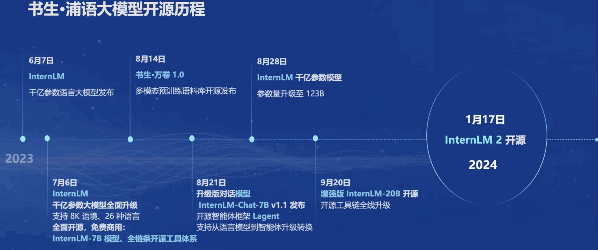

## 一.书生·浦语大模型的开源历程

InternLM2开源模型有7B和20B两种规格，同时每个规格包含三个模型版本：

* InternLM2-Base：高质量和具有很强可塑性的模型基座，是模型进行深度领域适配的高质量起点；
* InternLM2：在Base的基础上，对多个能力方向进行了优化，在评测中成绩优异，同时保持了很好的通用语言能力，是推荐的在大部分应用中考虑选用的优秀基座模型；
* InternLM2-Chat：在Base的基础上经过SFT和RLHF，面向对话交互进行了优化，具有很好的指令遵循、共情聊天和调用工具的能力。

InternLM2回归语言建模的本质，使用新一代数据清洗过滤技术 通过多维度数据价值评估、高质量语料驱动的数据富集和有针对性地数据补齐，提升模型下游任务的性能。

InternLM2的主要亮点：

* 超长上下文：模型在20万token上下文中几乎完美的实现"大海捞针";
* 综合性能全面提升：推理、数学、代码提升显著
* 优秀的对话和创作体验：精准指令跟随、丰富的结构化创作
* 工具调用能力整体提升：可靠支持工具多轮调用，复杂智能体搭建
* 突出的数理能力和实用的数据分析功能：强大的内生计算能力，加入代码解释后能力进一步提升

## 二.全链路开源体系

- 数据：书生·万卷覆盖多种模态与任务的2T数据
- 预训练：开源的InternLM-Train支持并行训练和极致优化，训练速度达到3600 tokens/sec/gpu
- 微调：XTuner开源框架支持全参数微调、Lora、QLora等低成本微调
- 部署：LMDeploy全链路部署，性能领先，每秒生成2000+ tokens
- 评测：OpenCompass全方位评测，性能可复现100套评测集、50万道题目
- 应用：Lagent AgentLego支持多种智能体，支持代码解释器等多种工具

###  1. 数据

### 2.预训练

### 3.微调

### 4.部署

### 5.评测

###  6.应用

