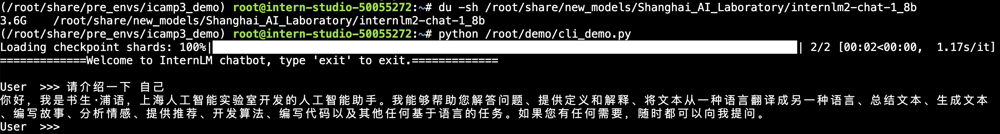
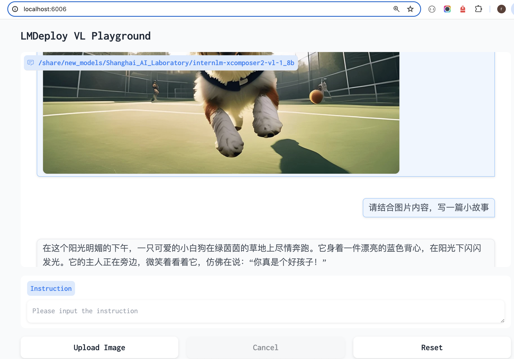
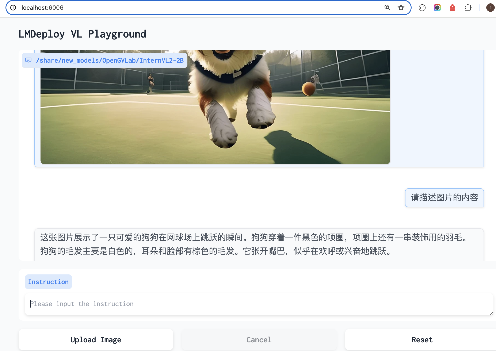

###  一.InternLM2-Chat-1.8B 模型的部署（基础任务）

### 1.cli 部署

准备：

```
conda activate /root/share/pre_envs/icamp3_demo
mkdir -p /root/demo
touch /root/demo/cli_demo.py
```

cli_demo.py是一个简单cli client应用。

执行：

```
python /root/demo/cli_demo.py
```

效果：




### 2.Streamlit web部署

准备：

```
cd /root/demo
git clone https://github.com/InternLM/Tutorial.git
```

执行streamlit，拉起服务:

```
streamlit run /root/demo/Tutorial/tools/streamlit_demo.py --server.address 127.0.0.1 --server.port 6006
```

端口映射：

```
ssh -CNg -L 6006:127.0.0.1:6006 root@ssh.intern-ai.org.cn -p 49828
```

本地访问localhost:6006


### 二.InternLM-XComposer2-VL-1.8B 模型的部署（进阶任务）

InternLM-XComposer2 是一款基于 InternLM2 的视觉语言大模型，其擅长自由形式的文本图像合成和理解。

LMDeploy 是一个用于压缩、部署和服务 LLM 的工具包，由 MMRazor 和 MMDeploy 团队开发。

部署：

```
conda activate /root/share/pre_envs/icamp3_demo
lmdeploy serve gradio /share/new_models/Shanghai_AI_Laboratory/internlm-xcomposer2-vl-1_8b --cache-max-entry-count 0.1
```

本地访问localhost:6006，上传图片并显示结果：




### 三.InternVL2-2B 模型的部署（进阶任务）

InternVL2 是上海人工智能实验室推出的新一代视觉-语言多模态大模型，是首个综合性能媲美国际闭源商业模型的开源多模态大模型。

InternVL2 系列从千亿大模型到端侧小模型全覆盖，通专融合，支持多种模态。

使用 LMDeploy 部署 InternVL2-2B 模型：

```
conda activate /root/share/pre_envs/icamp3_demo
lmdeploy serve gradio /share/new_models/OpenGVLab/InternVL2-2B --cache-max-entry-count 0.1
```

本地访问localohst:6006，上传图片并显示结果：




