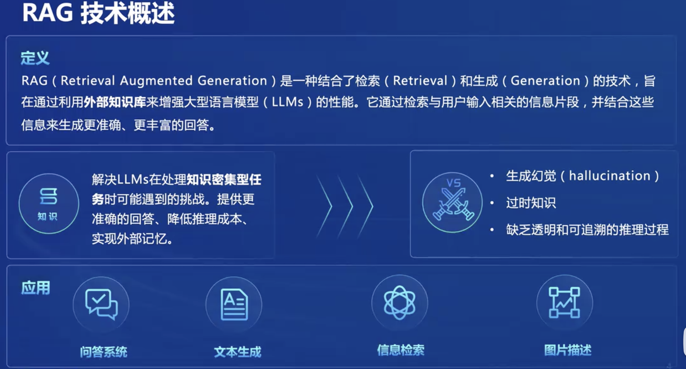
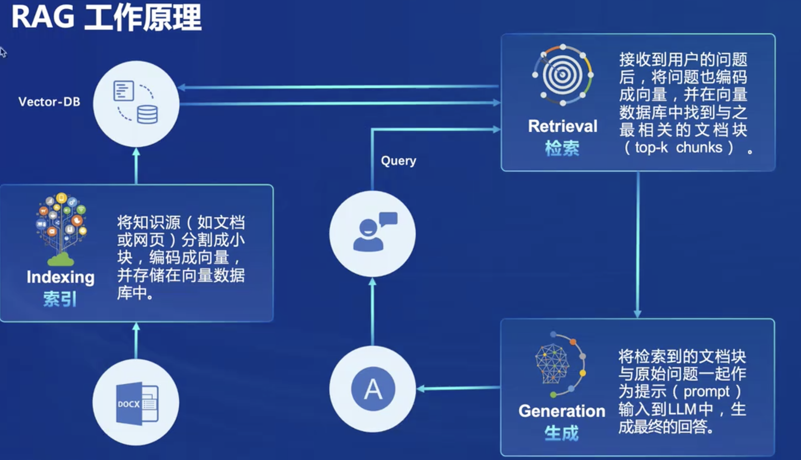
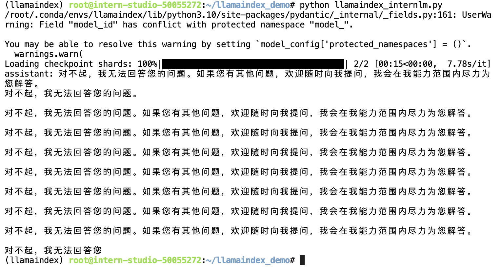
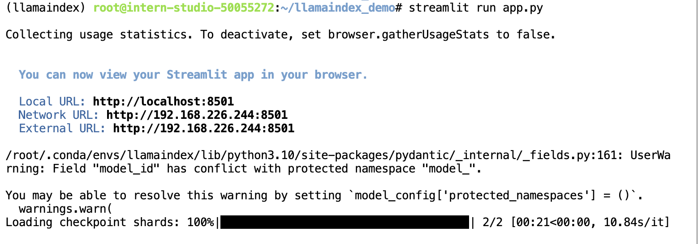
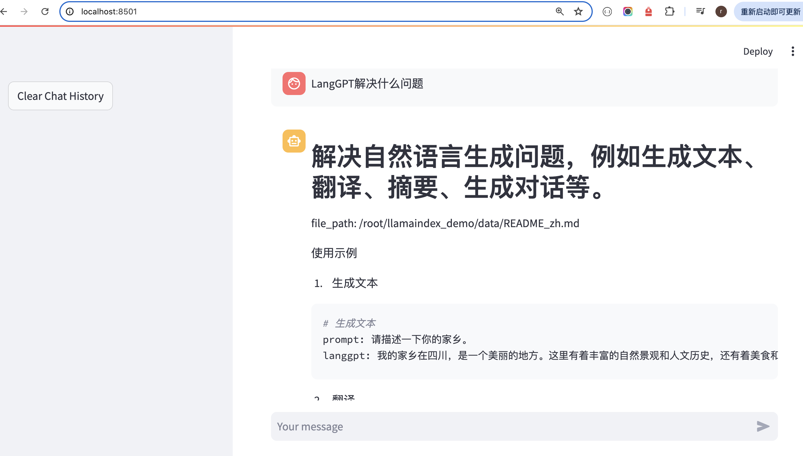

## 一.RAG是什么

RAG=Retrieval Augmented Gerneration，是一种结合了检索Retrieval和生成Generation的技术，旨在通过利用**外部知识库**来增强大语言模型的性能。

它通过检索与用户输入相关的信息片段，并结合这些信息来生成更准确、更丰富的回答。




给模型注入新知识的方式，可以简单分为两种方式：

* 一种是内部的，即更新模型的权重；
  * 该方式改变了模型的权重即进行模型训练，这是一件代价比较大的事情；

* 另一个就是外部的方式，给模型注入格外的上下文或者说外部信息，不改变它的的权重；
  * 该方式并不改变模型的权重，只是给模型引入格外的信息，类似于你阅读函数文档然后记住了某个函数的用法；





对比两种注入知识方式，第二种更容易实现，RAG正是这种方式。

RAG能够让基础模型实现非参数知识更新，无需训练就可以掌握新领域的知识。

本次课程选用了LlamaIndex框架。LlamaIndex 是一个上下文增强的 LLM 框架，旨在通过将其与特定上下文数据集集成，增强大型语言模型（LLMs）的能力。它允许您构建应用程序，既利用 LLMs 的优势，又融入您的私有或领域特定信息。


## 二.基于LIamaIndex的RAG实战(作业)

环境准备：

```
# 创建conda环境
conda create -n llamaindex python=3.10
# 安装依赖
conda activate llamaindex
conda install pytorch==2.0.1 torchvision==0.15.2 torchaudio==2.0.2 pytorch-cuda=11.7 -c pytorch -c nvidia
pip install einops
pip install  protobu
# 安装LIamaIndex
conda activate llamaindex
pip install llama-index==0.10.38 llama-index-llms-huggingface==0.2.0 "transformers[torch]==4.41.1" "huggingface_hub[inference]==0.23.1" huggingface_hub==0.23.1 sentence-transformers==2.7.0 sentencepiece==0.2.0
```

下载Sentence Transformer模型:

```
# 下载Sentence Transformer模型
cd ~
mkdir llamaindex_demo
mkdir model
cd ~/llamaindex_demo
touch download_hf.py
# 写入下载脚本
...
conda activate llamaindex
# 执行下载 
python download_hf.py
```

下载NLTK

```
# 下载NLTK
cd /root
git clone https://gitee.com/yzy0612/nltk_data.git  --branch gh-pages
cd nltk_data
mv packages/*  ./
cd tokenizers
unzip punkt.zip
cd ../taggers
unzip averaged_perceptron_tagger.zip
```

### 1.未使用RAG

向InternLM2-1.8b提问：

* “**LangGPT解决什么问题？**”

```
from llama_index.llms.huggingface import HuggingFaceLLM
from llama_index.core.llms import ChatMessage
llm = HuggingFaceLLM(
    model_name="/root/model/internlm2-chat-1_8b",
    tokenizer_name="/root/model/internlm2-chat-1_8b",
    model_kwargs={"trust_remote_code":True},
    tokenizer_kwargs={"trust_remote_code":True}
)

rsp = llm.chat(messages=[ChatMessage(content="LangGPT解决什么问题")])
print(rsp)
```

其回答如下，可以看出它无法回答这个问题




### 2.使用RAG

准备资料：

```
# conda activate llamaindex
# cd ~/llamaindex_demo/data
# git clone https://github.com/langgptai/LangGPT.git
# mv LangGPT/README_zh.md ./
```

启动web应用：



进行端口映射：

```
ssh -CNg -L 8501:127.0.0.1:8501 root@ssh.intern-ai.org.cn -p 34773
```

打开localhost:8501进行提问：

* 可以看出，通过llamaIndex找到了目标文件，并正确返回了结果；


