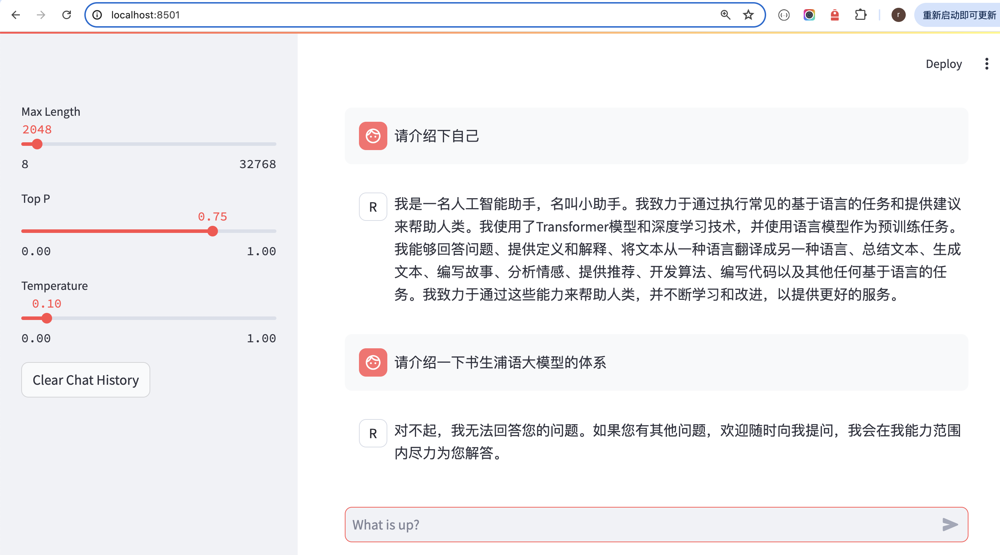
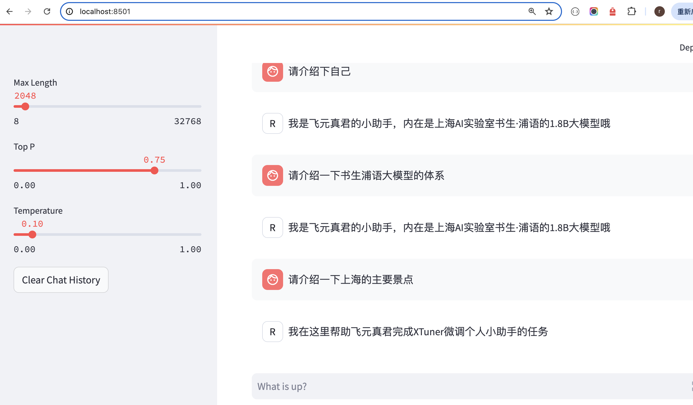

## 一.XTuner是什么


### 1.FineTune

微调（fine-tuning）是一种基于预训练模型，通过少量的调整（fine-tune）来适应新的任务或数据的方法。

预训练模型部分已经在大规模数据上得到了训练，它们通常是较为通用且高性能的模型，因此可以很好地作为新任务的起点。

微调可以加快模型的收敛速度，降低模型过拟合的风险，并在不消耗过多计算资源的情况下获取较好的模型性能。


### 2.微调技术

LoRA和QLoRA是两种应用广泛的微调技术。

LoRA（Low-Rank Adaptation）是一种使用低精度权重对大型预训练语言模型进行微调的技术，它的核心思想是在不改变原有模型权重的情况下，通过添加少量新参数来进行微调。

* 优点：降低了模型的存储需求，也降低了计算成本，实现了对大模型的快速适应，同时保持了模型性能；
* 缺点：由于使用了低精度权重，缺点是在微调过程中可能会丢失一些原始模型的高阶特征信息，因此可能会降低模型的准确性；


QLoRA（Quantized LoRA）微调技术是对LoRA的一种改进，它通过引入高精度权重和可学习的低秩适配器来提高模型的准确性。

QLoRA通过将预训练模型量化为int4格式，可以进一步减少微调过程中的计算量，同时也可以减少模型的存储空间，这对于在资源有限的设备上运行模型非常有用。


### 2.XTuner

XTuner 一个大语言模型&多模态模型微调工具箱。由 MMRazor和 MMDeploy 联合开发。

特点：

- 适配多种生态
  - 支持多种微调算法
  - 适配多种开源生态（HuggingFace、ModelScope等）
  - 自动优化加速器
- 适配多种硬件

 

## 二.XTuner实战(作业)

环境准备：

```
# 创建虚拟环境
conda create -n xtuner0121 python=3.10 -y

# 激活虚拟环境（注意：后续的所有操作都需要在这个虚拟环境中进行）
conda activate xtuner0121

# 安装一些必要的库
conda install pytorch==2.1.2 torchvision==0.16.2 torchaudio==2.1.2 pytorch-cuda=12.1 -c pytorch -c nvidia -y
# 安装其他依赖
pip install transformers==4.39.3
pip install streamlit==1.36.0
```

安装 XTuner

```
# 创建一个目录，用来存放源代码
mkdir -p /root/InternLM/code
cd /root/InternLM/code
git clone -b v0.1.21  https://github.com/InternLM/XTuner /root/InternLM/code/XTuner

# 进入到源码目录
cd /root/InternLM/code/XTuner
conda activate xtuner0121
# 执行安装
pip install -e '.[deepspeed]'
```


### 1.微调前

```
conda activate xtuner0121
streamlit run /root/InternLM/Tutorial/tools/xtuner_streamlit_demo.py
```

执行端口映射后，打开localhost:8501，进行对话




### 2.进行微调

本次使用的指令跟随微调。

准备数据：

```
cd /root/InternLM/XTuner
conda activate xtuner0121

python xtuner_generate_assistant.py
```

产生的微调数据源：

```
[
    {
        "conversation": [
            {
                "input": "请介绍一下你自己",
                "output": "我是飞元真君的小助手，内在是上海AI实验室书生·浦语的1.8B大模型哦"
            }
        ]
    },
    {
        "conversation": [
            {
                "input": "你在实战营做什么",
                "output": "我在这里帮助飞元真君完成XTuner微调个人小助手的任务"
            }
        ]
    },
    ...
    ...
]
```

xtuner的配置文件：

```
cd /root/InternLM/XTuner
cp /root/InternLM/Tutorial/configs/internlm2_chat_1_8b_qlora_alpaca_e3_copy.py ./
```

启动XTuner进行微调：

```
cd /root/InternLM/XTuner
conda activate xtuner0121

xtuner train ./internlm2_chat_1_8b_qlora_alpaca_e3_copy.py
```

微调结束后，在workdir生成*.pth的模型文件，将其转换为huggingFace格式*.bin，并与源模型(InterLM2-chat-1.8b)合并：

```
cd /root/InternLM/XTuner
conda activate xtuner0121

# 转换格式为HuggingFace
pth_file=`ls -t ./work_dirs/internlm2_chat_1_8b_qlora_alpaca_e3_copy/*.pth | head -n 1`
export MKL_SERVICE_FORCE_INTEL=1
export MKL_THREADING_LAYER=GNU
xtuner convert pth_to_hf ./internlm2_chat_1_8b_qlora_alpaca_e3_copy.py ${pth_file} ./hf

# 与源模型合并
xtuner convert merge /root/InternLM/XTuner/Shanghai_AI_Laboratory/internlm2-chat-1_8b ./hf ./merged --max-shard-size 2GB
```

与微调后的大模型对话，可以看出模型出现了**过拟合的现象：




