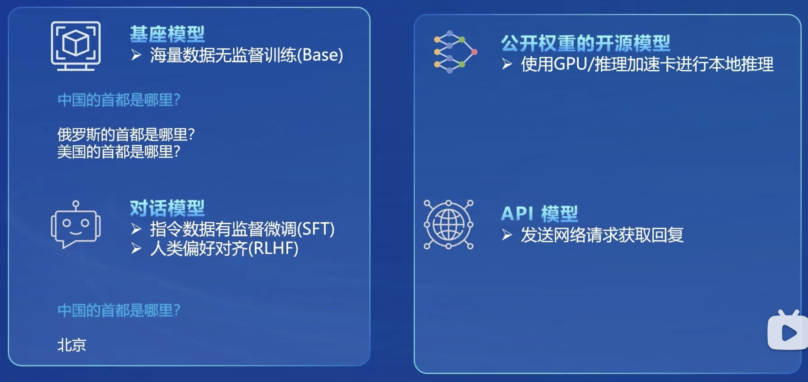
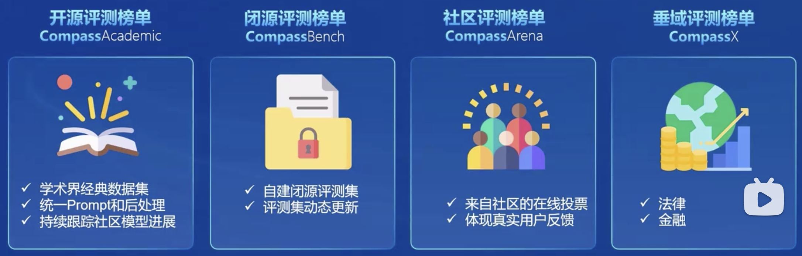
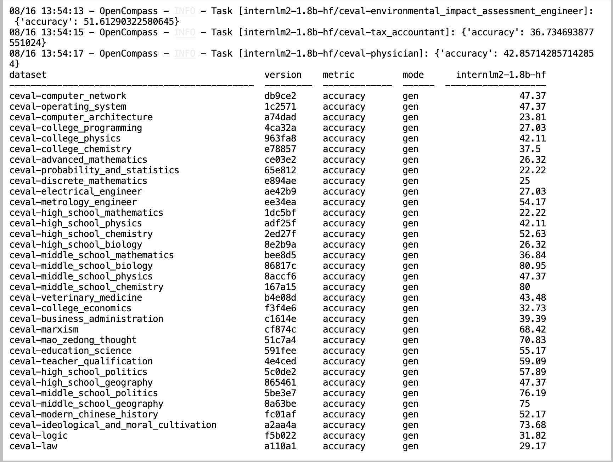
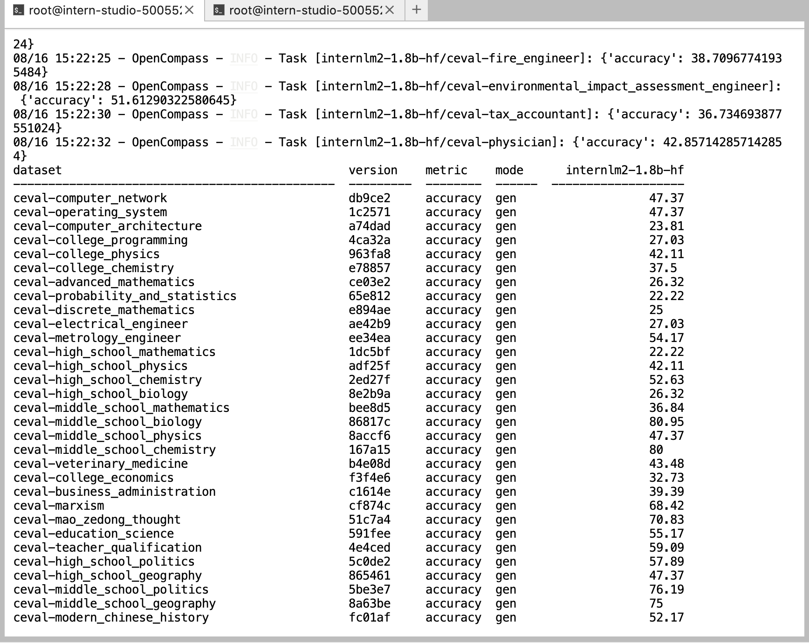

## 一.大模型评测

大模型评测的重要性：

* 模型研发的指挥棒: 评测体系决定了模型的研发方向以终为始才能行稳致远；
* 行业应用的加速器：行业应用需要基于垂域评测开展模型生产和应用研发；
* 超级对齐的必备组件：面向可扩展监督和超级对齐，基于模型的评测在人类无法提供有效监督时是必由之路；
* 产品落地的守门员：面向具体场景和具体应用，需要基于评测结果开展模型选型和模型准出；


大模型评测的挑战：
* 全面性
  * 大模型应用场景千变万化；
  * 如何设计和构造可扩展的能力维度体系；
* 数据污染
	* 海量语料不可避免带来评测集污染；
	* 如何设计可动态更新的高质量评测基准；
* 评测成本
	
	* 评测数十万道题需要大量算力资源；
	* 基于人工打分的主观评测成本高昂；
* 鲁棒性
  * 大模型对提示词十分敏感；
  * 多次采样情况下模型性能不稳定；


OpenCompass评测大模型的方法：

* 基座模型
* 公开权重的开源模型
* 对话模型
* API模型




OpenCompass的大模型评测体系：

* 构建科学、领先、公平的大模型评测体系，携手行业助力通用人工智能发展；




## 二.OpenCompass实战(作业)

C-Eval评测数据集：

> C-Eval是一个全面的中文基础模型评估套件，由上海交通大学、清华大学和爱丁堡大学的研究人员在2023年5月份联合推出。它包含了13948个多项选择题，涵盖了52个不同的学科和四个难度级别，用以评测大模型中文理解能力。


准备环境：

```
conda create -n opencompass python=3.10
conda activate opencompass
conda install pytorch==2.1.2 torchvision==0.16.2 torchaudio==2.1.2 pytorch-cuda=12.1 -c pytorch -c nvidia -y

# 注意：一定要先 cd /root
cd /root
git clone -b 0.2.4 https://github.com/open-compass/opencompass
cd opencompass
pip install -e .

apt-get update
apt-get install cmake
pip install -r requirements.txt
pip install protobuf
```

准备评测数据集：

```
cp /share/temp/datasets/OpenCompassData-core-20231110.zip /root/opencompass/
unzip OpenCompassData-core-20231110.zip
```


### 1.命令行进行评测

```
python run.py --datasets ceval_gen --models hf_internlm2_chat_1_8b --debug
```

评测结果，经过1个多小时的运行，其输入如下：




### 2.配置文件进行评测

准备配置文件：

```
from mmengine.config import read_base

with read_base():
    from .datasets.ceval.ceval_gen import ceval_datasets
    from .models.hf_internlm.hf_internlm2_chat_1_8b import models as hf_internlm2_chat_1_8b_models

datasets = ceval_datasets
models = hf_internlm2_chat_1_8b_models
```

执行：

```
cd /root/opencompass
python run.py configs/eval_tutorial_demo.py --debug
```


经过1个多小时的运行，评测结果如下:




