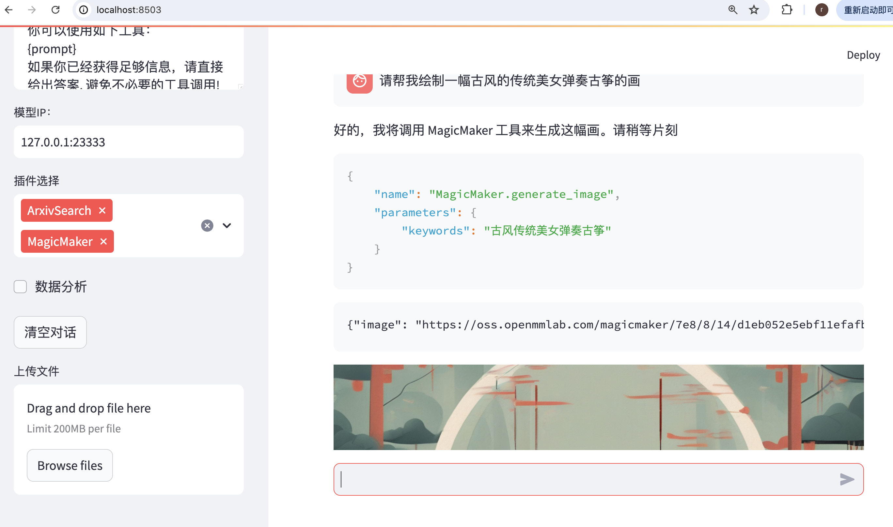

## 一.Lagent概述

Lagent 是一个轻量级开源智能体框架，旨在让用户可以高效地构建基于大语言模型的智能体。同时它也提供了一些典型工具以增强大语言模型的能力。

Lagent 目前已经支持了包括 AutoGPT、ReAct 等在内的多个经典智能体范式，也支持了如下工具：

- Arxiv 搜索
- Bing 地图
- Google 学术搜索
- Google 搜索
- 交互式 IPython 解释器
- IPython 解释器
- PPT
- Python 解释器

其基本结构如下所示：


## 二.Lagent实战(作业)

环境准备：

```
# 创建环境
conda create -n agent_camp3 python=3.10 -y
# 激活环境
conda activate agent_camp3
# 安装 torch
conda install pytorch==2.1.2 torchvision==0.16.2 torchaudio==2.1.2 pytorch-cuda=12.1 -c pytorch -c nvidia -y
# 安装其他依赖包
pip install termcolor==2.4.0
pip install lmdeploy==0.5.2
```

安装Lagent:

```
# 创建目录以存放代码
mkdir -p /root/agent_camp3
cd /root/agent_camp3
git clone https://github.com/InternLM/lagent.git
cd lagent && git checkout 81e7ace && pip install -e . && cd ..
```

启动API Server

```
conda activate agent_camp3
lmdeploy serve api_server /share/new_models/Shanghai_AI_Laboratory/internlm2_5-7b-chat --model-name internlm2_5-7b-chat
```

启动web demo:
```
cd /root/agent_camp3/lagent
conda activate agent_camp3
streamlit run examples/internlm2_agent_web_demo.py
```

进行端口映射 ：

```
ssh -CNg -L 8501:127.0.0.1:8501 -L 23333:127.0.0.1:23333 root@ssh.intern-ai.org.cn -p 33141
```

在本地浏览器中访问localhost:8501，发现报错：

```
ModuleNotFoundError: No module named 'griffe.enumerations'
```

解决方法：

* 降低griffe的版本

```
pip install griffe==0.48
```


执行论文搜索：


执行MagicMaker文生图：




> 这个古筝怎么悬空了？？！！
>
> 斜着身子弹琴不累吗？？！！


