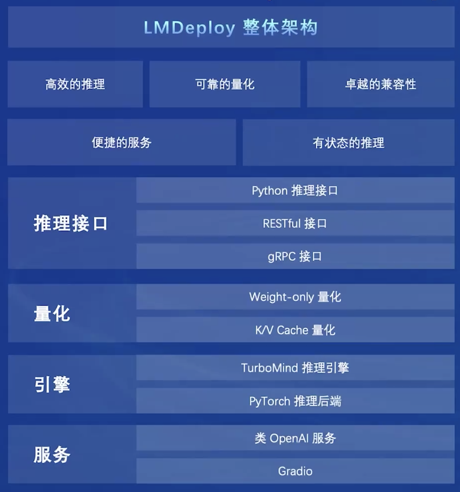
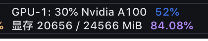
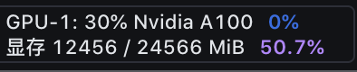
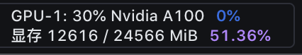
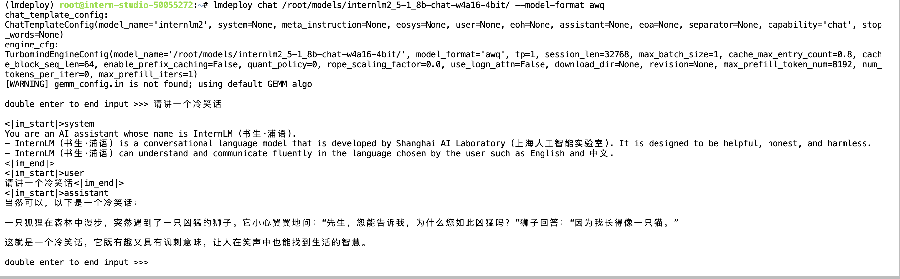
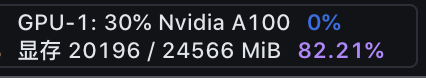
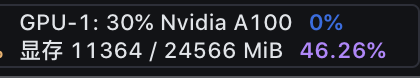
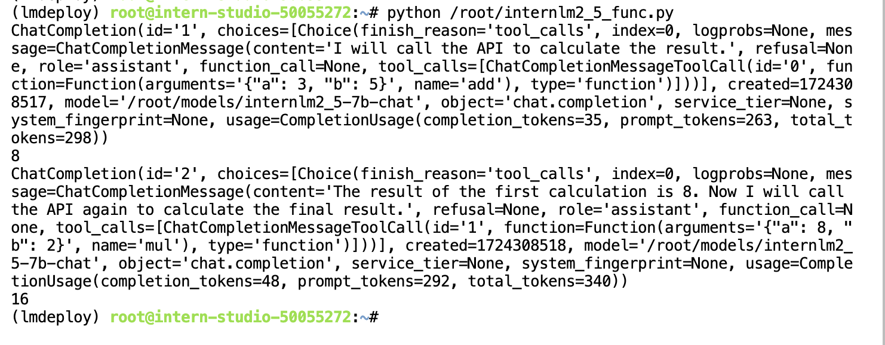

## 一.LMDeploy概述 



### 1.kv-cache

kv-cache可以理解为对大模型推理过程中的Key-value缓存的优化。

* 对于新的请求Query，需要与历史的key/value计算注意力分数；
* 如果每次都重新计算历史key/value，会浪费大量计算资源；
* 每轮新迭代时，将key/value进行缓存，供下次迭代使用；

lmdeploy对KV cache的实现：

* 预先申请策略：减少运行时因申请/释放内存的消耗时间；
* 通过设置cache_max_entry_count参数来调节KV Cache占用内存的大小，为占用**剩余显存**的比例；


###  2.量化技术

量化技术将传统的表示方法中的浮点数转换为整数或其它离散形式，以减轻深度学习模型的存储和计算负担。

为什么要做量化？

* 提升推理的速度；
  * 速度更快的Kernel；
  * 降低I/O延迟；
* 增加上下文长度；
* 降低推理成本；

量化的分类：

* 按量化对象分

  * KV Cache量化；**lmdeploy使用**
  * 模型权重量化；**lmdeploy使用**
  * 激活值量化；
  
* 按量化阶段分
	* 量化感知训练(QAT)
	* 量化感知微调(QAF)
	* 训练后量化(PTQ): **常用，lmdeploy使用**
	


lmdeploy对KV Cache的量化：

* 在线KV Cache INT4/INT8量化，粒度为per-head per-token;
* 与FP16相比，INT4和INT8的KV Block数量分别可以提升4倍和2倍；
  * 意味着更长的上下文，更高的并发吞吐；
* 精度上INT8几乎无损，INT4略有损失；


lmdeploy对权重的量化：

* W4A16量化：权重4bit量化，激活值16bit不量化；

  * AWQ算法，对权重进行4bit量化，计算时使用FP16;
    * 存储使用4bit，计算时还需反量化为FP16，与激活值相乘；

  * 性能是FP16的2.4倍以上；

  * 权重大小、显存降为FP16的1/4;


###  3.外推技术  

长度外推性是一个训练和预测的长度不一致的问题。

外推引发的问题：

* 预测阶段用到了没训练过的位置编码
  * 模型不可避免在一定程度上对位置编码”过拟合“；
* 预测注意力时注意力机制所处理的token数量远超训练时的数量 
  * 导致计算注意力”熵“的差异较大；


解决方案：从位置编码角度解决

* NTK-aware外推技术；
* 预测阶段，计算系数，对位置编码的底数base进行缩放。


### 4.Function Calling

Function Calling，即为让LLM调用外部函数解决问题，从而拓展LLM的能力边界。

Function calling的意义：

* 解决时效性问题：
  * 今天的日期？天气如何？
* 拓展LLM能力边界
  * 帮过我计算e^8/123；


## 二. LMDeploy实战(作业)

由于InternLM2.5-7b模型的量化过程太长，本文以1.8b为例进行实验。

lmdeploy启动1.8-chat，查看显存占用：

```
lmdeploy chat /root/models/internlm2_5-1_8b-chat
```



占用的显存计算过程：

* 1.8b的参数 ：1.8\*10^9\*2B=3.35GiB
* kv-cache: （24GiB-3.35GiB)\*0.8 =16.52GiB
* 共计：16.52 + 3.35 + 1(额外) = 20.87GiB

### 1.设置kv-cache

配置kv-cache使用剩余显存的0.4

```
lmdeploy chat /root/models/internlm2_5-1_8b-chat --cache-max-entry-count 0.4
```



占用的显存计算过程：

* 1.8b的参数 ：1.8\*10^9\*2B=3.35GiB
* kv-cache: （24GiB-3.35GiB)\*0.4 =8.26GiB
* 共计：8.26 + 3.35 + 1(额外) = 12.61GiB


  ### 2.设置在线kv-cache的int4量化

通过--quant-policy 4配置kv-cache使用int4量化

```
lmdeploy serve api_server \
    /root/models/internlm2_5-1_8b-chat \
    --model-format hf \
    --quant-policy 4 \
    --cache-max-entry-count 0.4\
    --server-name 0.0.0.0 \
    --server-port 23333 \
    --tp 1
```



可以看到，占用的显存与未使用kv-cache的int4量化差不多，但是相比FP16，int4的Cache可以存储的元素数量是BF16的四倍。


### 3.W4A16的量化和部署

执行量化命令：

```
lmdeploy lite auto_awq \
   /root/models/internlm2_5-1_8b-chat \
  --calib-dataset 'ptb' \
  --calib-samples 128 \
  --calib-seqlen 2048 \
  --w-bits 4 \
  --w-group-size 128 \
  --batch-size 1 \
  --search-scale False \
  --work-dir /root/models/internlm2_5-1_8b-chat-w4a16-4bit
```

经过**约2个小时**的运行，量化成功，查看模型大小：

```
# du -sh /root/models/*
...
1.5G    /root/models/internlm2_5-1_8b-chat-w4a16-4bit
...
```

再看一下原始的模型大小：

* 经过量化，模型大小从3.6G降低为1.5G；

```
# du -sh /root/share/new_models/Shanghai_AI_Laboratory/*
...
3.6G    /root/share/new_models/Shanghai_AI_Laboratory/internlm2_5-1_8b-chat
...
```

使用lmdeploy启动模型，查看其显存占用：

```
lmdeploy chat /root/models/internlm2_5-1_8b-chat-w4a16-4bit/ --model-format awq
```





占用显存的计算过程：

* 1.8b的权重参数：1.8\*10^9\*0.5B=0.84GiB
* kv-cache: (24GiB - 0.84GiB)\*0.8 = 18.53GiB
* 共计：0.84 + 18.53 +  1(额外) = 20.37GiB


### 4.W4A16 量化+ KV cache+KV cache 量化

* 使用量化后的模型；
* 配置kv-cache使用空闲显存的 0.4；
* kv-cache配置Int4量化；

```
lmdeploy serve api_server \
    /root/models/internlm2_5-1_8b-chat-w4a16-4bit \
    --model-format awq \
    --quant-policy 4 \
    --cache-max-entry-count 0.4\
    --server-name 0.0.0.0 \
    --server-port 23333 \
    --tp 1
```



占用显存的计算过程：

* 1.8b的权重参数：1.8\*10^9\*0.5B=0.84GiB
* kv-cache: (24GiB - 0.84GiB)\*0.4 = 9.27GiB
* 共计：0.84 + 9.27 +  1(额外) = 11.11GiB


### 5.Function Calling

首先，部署api-server:

```
conda activate lmdeploy
lmdeploy serve api_server \
    /root/models/internlm2_5-7b-chat \
    --model-format hf \
    --quant-policy 0 \
    --server-name 0.0.0.0 \
    --server-port 23333 \
    --tp 1
```

然后，准备py代码：

```
touch /root/internlm2_5_func.py
```

```
from openai import OpenAI

def add(a: int, b: int):
    return a + b

def mul(a: int, b: int):
    return a * b

tools = [{
    'type': 'function',
    'function': {
        'name': 'add',
        'description': 'Compute the sum of two numbers',
        'parameters': {
            'type': 'object',
            'properties': {
                'a': {
                    'type': 'int',
                    'description': 'A number',
                },
                'b': {
                    'type': 'int',
                    'description': 'A number',
                },
            },
            'required': ['a', 'b'],
        },
    }
}, {
    'type': 'function',
    'function': {
        'name': 'mul',
        'description': 'Calculate the product of two numbers',
        'parameters': {
            'type': 'object',
            'properties': {
                'a': {
                    'type': 'int',
                    'description': 'A number',
                },
                'b': {
                    'type': 'int',
                    'description': 'A number',
                },
            },
            'required': ['a', 'b'],
        },
    }
}]
messages = [{'role': 'user', 'content': 'Compute (3+5)*2'}]

client = OpenAI(api_key='YOUR_API_KEY', base_url='http://0.0.0.0:23333/v1')
model_name = client.models.list().data[0].id
response = client.chat.completions.create(
    model=model_name,
    messages=messages,
    temperature=0.8,
    top_p=0.8,
    stream=False,
    tools=tools)
print(response)
func1_name = response.choices[0].message.tool_calls[0].function.name
func1_args = response.choices[0].message.tool_calls[0].function.arguments
func1_out = eval(f'{func1_name}(**{func1_args})')
print(func1_out)

messages.append({
    'role': 'assistant',
    'content': response.choices[0].message.content
})
messages.append({
    'role': 'environment',
    'content': f'3+5={func1_out}',
    'name': 'plugin'
})
response = client.chat.completions.create(
    model=model_name,
    messages=messages,
    temperature=0.8,
    top_p=0.8,
    stream=False,
    tools=tools)
print(response)
func2_name = response.choices[0].message.tool_calls[0].function.name
func2_args = response.choices[0].message.tool_calls[0].function.arguments
func2_out = eval(f'{func2_name}(**{func2_args})')
print(func2_out)
```


最后，执行function calling:



