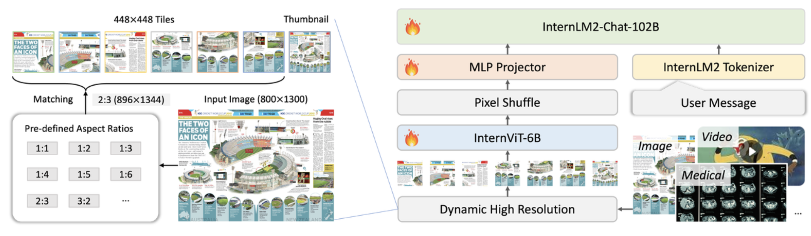
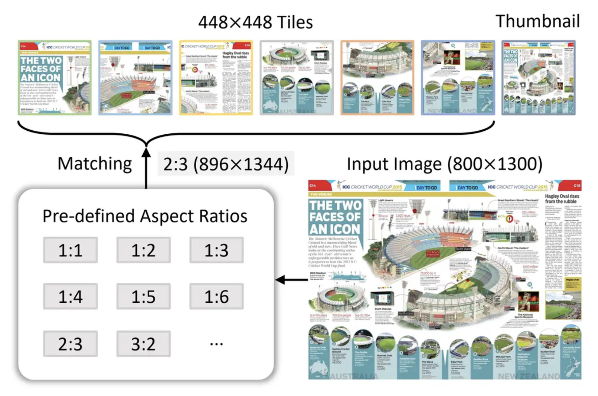
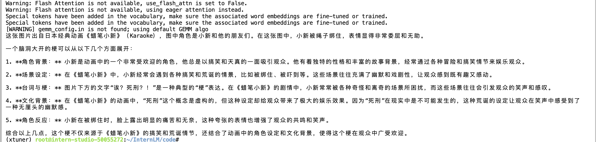
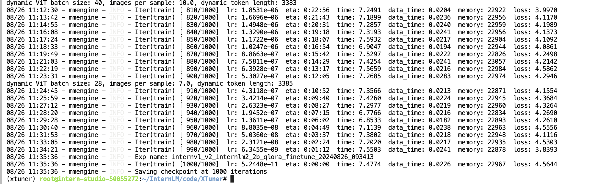
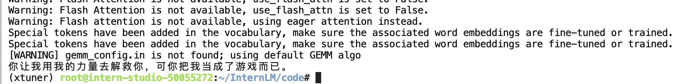
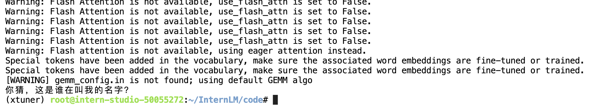

## 一.InternVL概述

InternVL 是一种用于多模态任务的深度学习模型，旨在处理和理解多种类型的数据输入，如图像和文本。

InternVL结合了视觉和语言模型，能够执行复杂的跨模态任务，比如图文匹配、图像描述生成等。通过整合视觉特征和语言信息，InternVL 可以在多模态领域取得更好的表现。



对于InternVL这个模型来说，它vision模块就是一个微调过的ViT，llm模块是一个InternLM的模型。


对于视觉模块来说，它的特殊之处在Dynamic High Resolution：动态高分辨率。

动态高分辨率是为了让ViT模型能够尽可能获取到更细节的图像信息，提高视觉特征的表达能力。对于输入的图片，首先resize成448的倍数，然后按照预定义的尺寸比例从图片上crop对应的区域。



Pixel Shuffle在超分任务中是一个常见的操作，PyTorch中有官方实现，即nn.PixelShuffle(upscale_factor) 。

该类的作用就是将一个tensor中的元素值进行重排列，假设tensor维度为[B, C, H, W], PixelShuffle操作不仅可以改变tensor的通道数，也会改变特征图的大小。


## 二.InternVL冷笑话大师FineTuning

配置虚拟环境

```
conda create --name xtuner python=3.10 -y

# 激活虚拟环境（注意：后续的所有操作都需要在这个虚拟环境中进行）
conda activate xtuner

# 安装一些必要的库
conda install pytorch==2.1.2 torchvision==0.16.2 torchaudio==2.1.2 pytorch-cuda=12.1 -c pytorch -c nvidia -y
# 安装其他依赖
apt install libaio-dev
pip install transformers==4.39.3
pip install streamlit==1.36.0
```

安装xtuner 1.23

```
# 创建一个目录，用来存放源代码
mkdir -p /root/InternLM/code

cd /root/InternLM/code

git clone -b v0.1.23  https://github.com/InternLM/XTuner

cd /root/InternLM/code/XTuner
pip install -e '.[deepspeed]'
```

准备finetuning数据集

```
## 首先让我们安装一下需要的包
pip install datasets matplotlib Pillow timm

## 让我们把数据集挪出来
cp -r /root/share/new_models/datasets/CLoT_cn_2000 /root/InternLM/datasets/
```


### 1.微调前

```
from lmdeploy import pipeline
from lmdeploy.vl import load_image

pipe = pipeline('/root/model/InternVL2-2B')

image = load_image('/root/InternLM/datasets/ex_images/007aPnLRgy1h7f4k3irx8j30ci0eljsd.jpg')
response = pipe(('请你根据这张图片，讲一个脑洞大开的梗', image))
print(response.text)
```


其输出内容：



我们发现直接使用2b模型不能很好的讲出梗。


### 2.执行微调

微调数据集：

```
cp -r /root/share/new_models/datasets/CLoT_cn_2000 /root/InternLM/datasets/
```

数据集的格式：

```
[
  {
    "image": "ex_images/MjxjVcrFf9TFLbr2BKR4Py1L5qAic8K4VzEQAsTph0ztWe9vj3d8DGDdAC3tJV0aiaOrSBcsKpBIXIAh6O1CDXcA.jpg",
    "conversations": [
      {
        "from": "human",
        "value": "<image>\n请你根据这张图片，讲一个脑洞大开的梗"
      },
      {
        "from": "gpt",
        "value": "果然！大家都会把鼻屎抹在课桌下面"
      }
    ]
  },
  ...
]
```

配置微调参数：

* 修改基座模型的path：/root/model/InternVL2-2B
* 修改微调数据集的path
* 修改batch_size=4
* max_epochs = 2

**执行**微调：

```
cd XTuner

NPROC_PER_NODE=1 xtuner train /root/InternLM/code/XTuner/xtuner/configs/internvl/v2/internvl_v2_internlm2_2b_qlora_finetune.py  --work-dir /root/InternLM/work_dir/internvl_ft_run_8_filter  --deepspeed deepspeed_zero1
```

使用50%的A100，微调需要2小时：



执行权重合并 ：

```
cd XTuner
# transfer weights
python xtuner/configs/internvl/v1_5/convert_to_official.py xtuner/configs/internvl/v2/internvl_v2_internlm2_2b_qlora_finetune.py /root/InternLM/work_dir/internvl_ft_run_8_filter/iter_1000.pth /root/InternLM/convert_model/
```


### 3.微调后

```
from lmdeploy import pipeline
from lmdeploy.vl import load_image

pipe = pipeline('/root/InternLM/convert_model')

image = load_image('/root/InternLM/datasets/ex_images/007aPnLRgy1h7f4k3irx8j30ci0eljsd.jpg')
response = pipe(('请你根据这张图片，讲一个脑洞大开的梗', image))
print(response.text)
```


输出：




再试试其它的图片：


微调后的模型输出：




