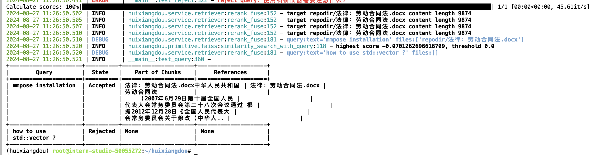
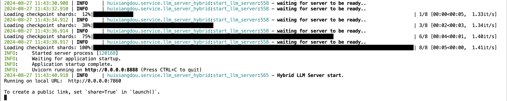
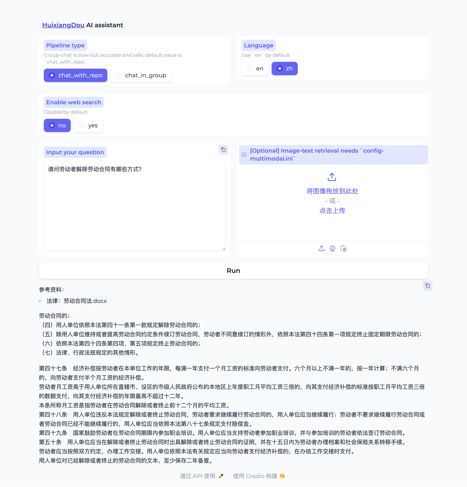
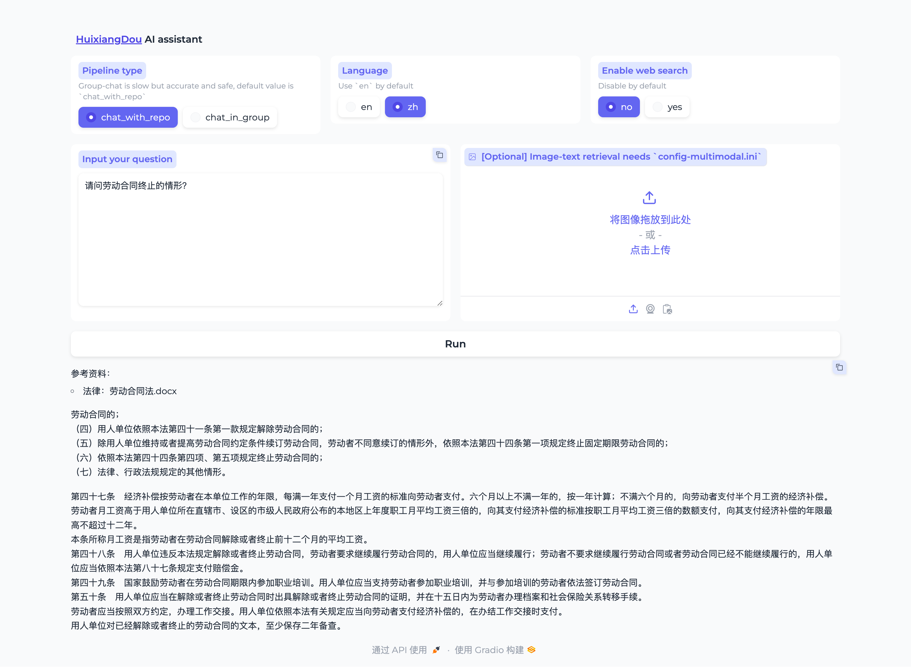
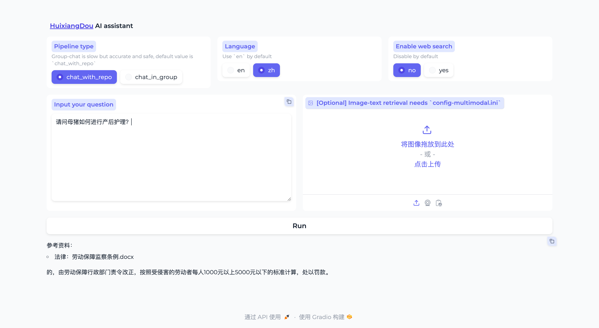
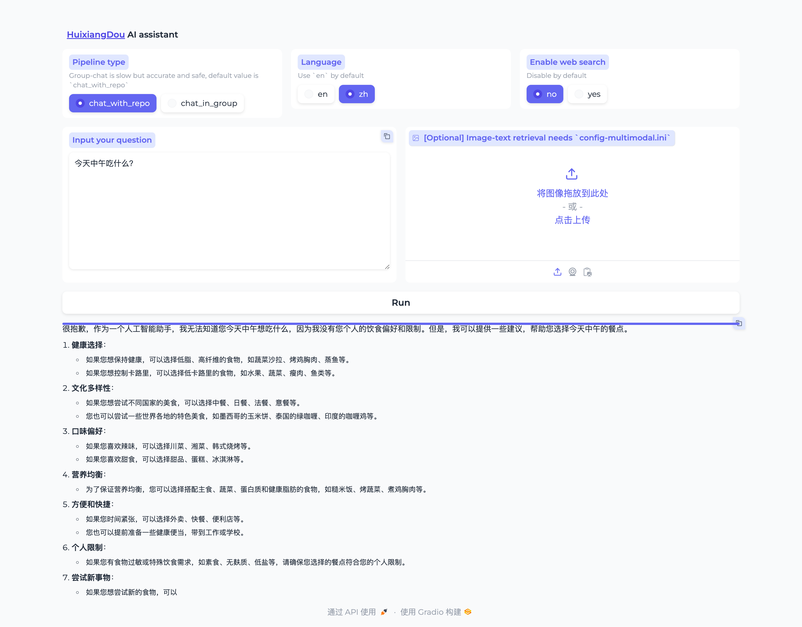

## 一.茴香豆概述


茴香豆是由书生·浦语团队开发的一款开源、专门针对国内企业级使用场景设计并优化的知识问答工具。


在基础 RAG 课程中我们了解到，RAG 可以有效的帮助提高 LLM 知识检索的相关性、实时性，同时避免 LLM 训练带来的巨大成本。

在实际的生产和生活环境需求，对 RAG 系统的开发、部署和调优的挑战更大，如需要解决群应答、能够无关问题拒答、多渠道应答、更高的安全性挑战。


因此，根据大量国内用户的实际需求，总结出了**三阶段Pipeline**的茴香豆知识问答助手架构，帮助企业级用户可以快速上手安装部署。

**茴香豆特点**：

- 三阶段 Pipeline （前处理、拒答、响应），提高相应准确率和安全性
- 打通微信和飞书群聊天，适合国内知识问答场景
- 支持各种硬件配置安装，安装部署限制条件少
- 适配性强，兼容多个 LLM 和 API
- 傻瓜操作，安装和配置方便


## 二.茴香豆实战

将茴香豆从源码部署到以 InternlmStudio。

### 1. 准备环境

```
# 创建虚拟环境
studio-conda -o internlm-base -t huixiangdou
```

从源码安装茴香豆：

```
cd /root
# 克隆代码仓库
git clone https://github.com/internlm/huixiangdou && cd huixiangdou
git checkout 79fa810
```

准备模型文件：

```
# 创建模型文件夹
cd /root && mkdir models

# 复制BCE模型
ln -s /root/share/new_models/maidalun1020/bce-embedding-base_v1 /root/models/bce-embedding-base_v1
ln -s /root/share/new_models/maidalun1020/bce-reranker-base_v1 /root/models/bce-reranker-base_v1

# 复制大模型参数（下面的模型，根据作业进度和任务进行**选择一个**就行）
ln -s /root/share/new_models/Shanghai_AI_Laboratory/internlm2-chat-7b /root/models/internlm2-chat-7b
```

### 2. 创建知识库

这里以劳动法相关的法律文书为例，创建茴香豆的知识库：

```
 ls -alh repodir/
total 49K
drwxr-xr-x  2 root root 4.0K Aug 27 11:23 .
drwxr-xr-x 17 root root 4.0K Aug 27 11:22 ..
-rw-r--r--  1 root root  20K Aug 27 11:23 法律：劳动保障监察条例.docx
-rw-r--r--  1 root root  27K Aug 27 11:23 法律：劳动合同法.docx
```

```
mkdir workdir
python3 -m huixiangdou.service.feature_store
```




### 3.搭建Gradio UI 界面

```
conda activate huixiangdou
cd /root/huixiangdou
python3 -m huixiangdou.gradio
```



配置端口映射：

```
ssh -CNg -L 7860:127.0.0.1:7860 root@ssh.intern-ai.org.cn -p 34773
```

本机访问localhost:7860，并进行提问 ：












