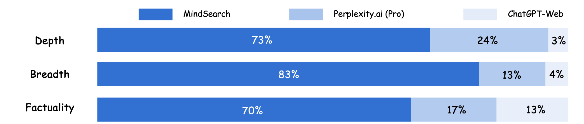
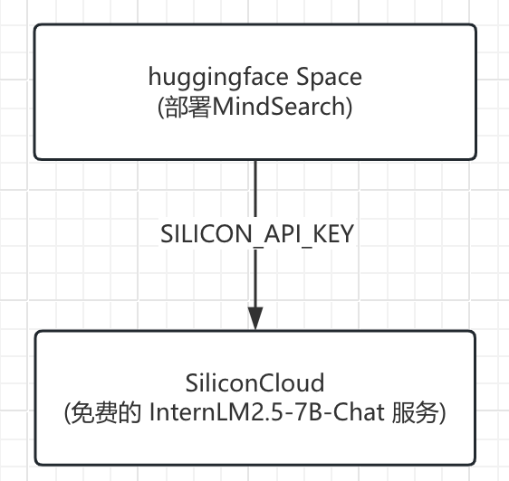
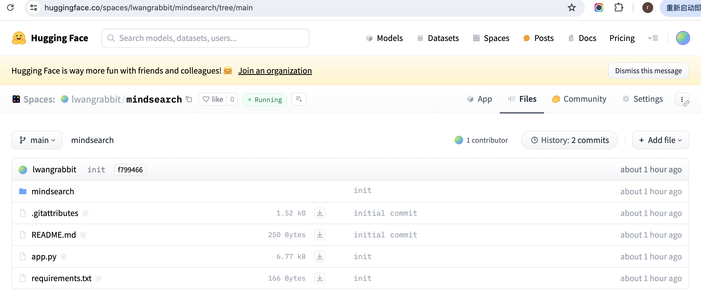
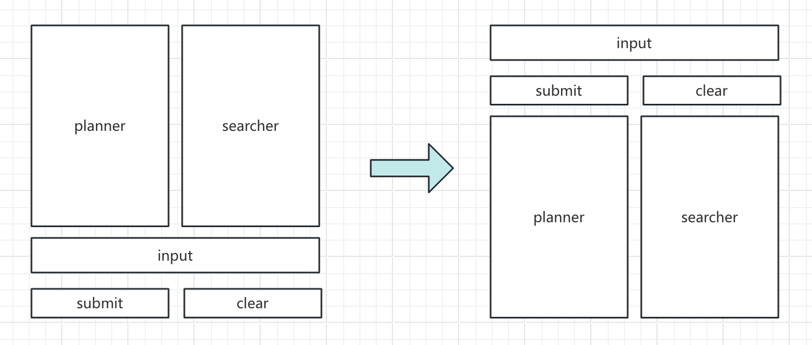
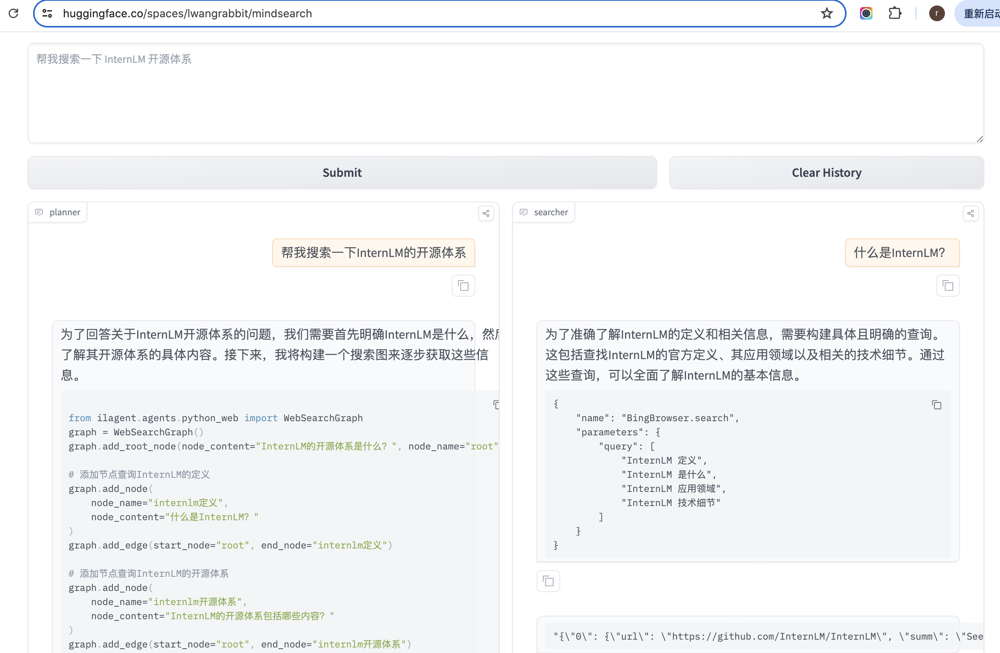
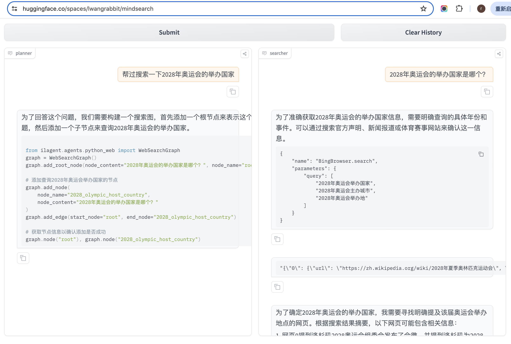

## 一.MindSearch概述

MindSearch 是一个开源的 AI 搜索引擎框架，具有与 Perplexity.ai Pro 相同的性能。

MindSearch可以轻松部署来构建自己的搜索引擎，可以使用闭源 LLM（如 GPT、Claude）或开源 LLM。

MindSearch拥有以下特性：

- MindSearch 通过搜索解决你在生活中遇到的各种问题
- MindSearch 通过数百网页的浏览，提供更广泛、深层次的答案
- MindSearch 提供了思考路径、搜索关键词等完整的内容，提高回复的可信度和可用性。
- 为用户提供各种接口，包括 React、Gradio、Streamlit 和本地调试。根据需要选择任意类型。
- MindSearch 将用户查询分解为图中的子问题节点，并根据 WebSearcher 的搜索结果逐步扩展图。


在深度、广度和生成响应的准确性三个方面，对 ChatGPT-Web、Perplexity.ai（Pro）和 MindSearch 的表现进行比较。

可以看出，在上面的三个方面上，MindSearch均有不俗的表现。




## 二.MindSearch实战(作业)

### 1.部署 

整体部署架构如下：

* 底层的大模型使用SiliconCloud免费的InternLM2.5-7B-Chat
* 上层的MindSearch部署在HuggingFace的免费Space中，通过 Gradio提供了一个简单的访问页面；



MindSearch中访问SiliconCloud中InternLM服务的代码：

* 使用的模型为internlm/internlm2_5-7b-chat
* 使用环境变量SILICON_API_KEY，访问的API为：
  * https://api.siliconflow.cn/v1/chat/completions

```
internlm_silicon = dict(type=GPTAPI,
                        model_type='internlm/internlm2_5-7b-chat',
                        key=os.environ.get('SILICON_API_KEY', 'YOUR SILICON API KEY'),
                        openai_api_base='https://api.siliconflow.cn/v1/chat/completions',
                        meta_template=[
                            dict(role='system', api_role='system'),
                            dict(role='user', api_role='user'),
                            dict(role='assistant', api_role='assistant'),
                            dict(role='environment', api_role='system')
                        ],
                        top_p=0.8,
                        top_k=1,
                        temperature=0,
                        max_new_tokens=8192,
                        repetition_penalty=1.02,
                        stop_words=['<|im_end|>'])
```


在将MindSpace部署到huggingFace的Space时，我们使用**git ssh**命令，将MindSearch push到Space的仓库中去。

* 地址：https://huggingface.co/spaces/lwangrabbit/mindsearch/tree/main



### 2.样式修改

默认的样式  VS  修改后的样式

* 按照正常的交互习惯，将输入框和搜索按钮放在上面，将运行过程的planer/searcher放在下面；




### 3.对话效果

第一个搜索对话：



第二个搜索对话：




### 参考：

1.https://docs.siliconflow.cn/docs/use-mindsearch-with-siliconcloud

